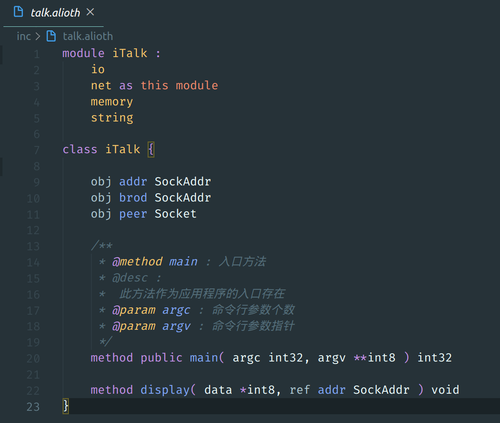
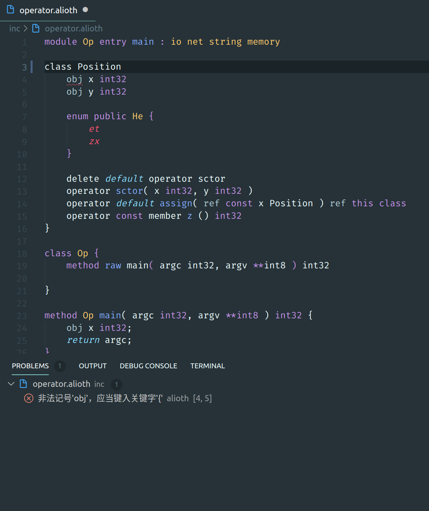

# alioth-language-support

This extension provides language support to the Alioth programming language using the features provided by the compiler.

This extension is under developing.

## Features

- color support

  Maybe the worst color support, I'm trying to get it better.

  

- semantic check
  
  This extension setup communication between the Alioth compiler once it is started.
  Each time the Alioth source code document is modified, the extension send a request to make the compiler run the diagnostic process. There's no need to wary about the cost when the request frequently sent to the compiler, the compiler caches all syntax trees affected, each time a request arrives, the compiler rescan the documents modified only.

  

  This function requires you to have the Alioth compiler installed, check the original [repository](https://github.com/dn-ezr/alioth-compiler) for more information.

## Requirements

Presently, we can only support the platform of linux, and you have to make sure that your alioth compiler is avaliable.

- The Compiler of Alioth

  You can visit https://dn-ezr.cn for more information about the Alioth programming language, and that is also where you get the download link of the compiler.

## Extension Settings

- logCompilerPackage

  This option is used to make the extension print all packages received from and sent to the compiler. It is developed for debug purpose and seems not working in the release mode.

- workSpaceUri

  This option is used to make the compiler focus on certain folder only, so that the extension can work properly even if the workspace uri doesn't point to the Alioth project root path.

  Though this option is called `uri`, the string in uri format is not the only kind of value which is acceptable. Path strings are available too.

## Known Issues

- bad color support
  
  Limited by the ability of regular expression, the color support is not ready right now.

## Release Notes

This is the first release.

### 0.0.9

Add more support to the Alioth protocol.

- Fix bug where extension exits leave the compiler fall in infinite loop.

### 0.0.8

Enable support to the brand new compiler which is named `alioth`.

### 0.0.7

Disable the disabled functions...

### 0.0.6

Add some color support to new language standard.

### 0.0.5

Fix bug where .vscodeignore cause bad dependencies.

### 0.0.2

Fix problem where dependencies were bad.

### 0.0.1

Initial release of Alioth language support.